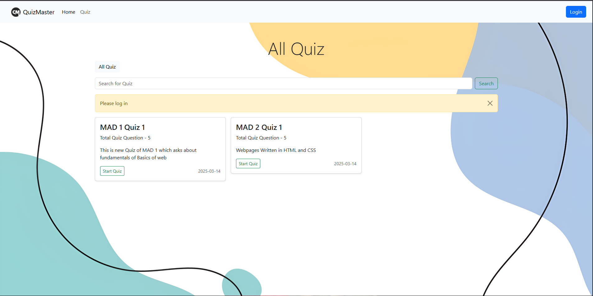
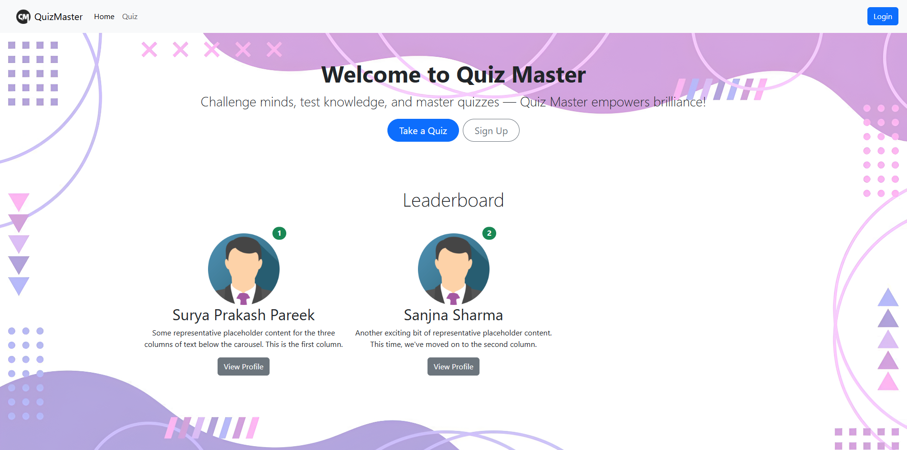

# Quiz Master Web Application

A **Flask-based Quiz Web App** developed individually as part of the **Modern Application Development (MAD)** course in my **BS Degree – Programming Diploma at IIT Madras**.  
It allows users to attempt quizzes, track scores, and practice interactively.

---

## 🏆 Features

- Secure **User Authentication** (Signup/Login)  
- **Dynamic Quiz System** with question storage & evaluation  
- Real-time **Score Calculation & Tracking**  
- **Responsive UI** compatible with desktop and mobile devices  

---

## ⚙️ Tech Stack

- **Backend:** Python (Flask), SQLAlchemy ORM  
- **Frontend:** HTML, CSS, JavaScript, Bootstrap  
- **Database:** SQLite3  
- **Deployment:** [Live Demo Link](https://quiz-master-qydp.onrender.com/) 

---

## 💡 Project Overview

This project was designed to strengthen full-stack development skills, including:

- Integrating authentication with database models  
- Implementing dynamic content and score tracking  
- Designing user-friendly and responsive interfaces  
- Debugging and deploying real-world web applications  

---
Screenshots:

---

## 📂 Demo & Repo Links

- **Live Demo:** [Link](https://quiz-master-qydp.onrender.com/)  
- **GitHub Repository:** [Link](https://github.com/Surya-prakash-pareek/Quiz-Master-V1)

---

## 🧠 Learnings

- Full-stack development using Flask and SQLAlchemy  
- Database management and ORM integration  
- Frontend design for responsive applications  
- End-to-end deployment of a web application  

---

## 📢 Feedback

I’d love to hear feedback or suggestions to improve the application further!  

---
